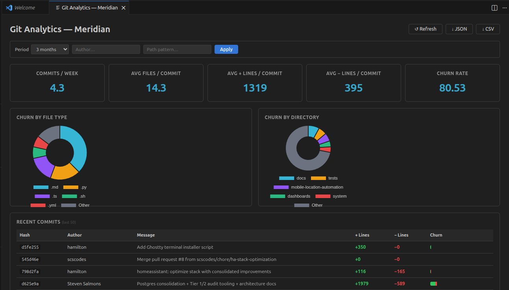
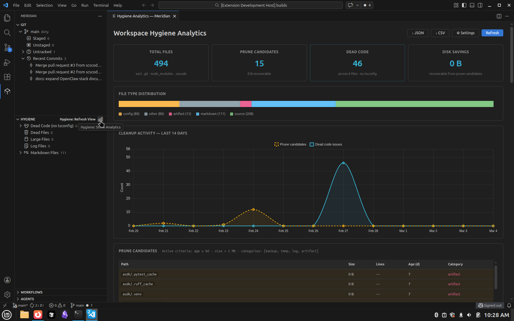

# Meridian

**AI-powered git, code hygiene, and workflow tools for VS Code.**

Meridian brings smart commit grouping, PR generation and review, workspace hygiene scanning, JSON-defined workflows, autonomous agents, and deep Copilot Chat integration into a single extension.

---

## Feature Highlights

### Git AI

- **Smart Commit** -- groups staged changes by semantic type, suggests messages via LLM, and commits in batch with an interactive approval UI.
- **PR Generation & Review** -- generate PR descriptions, run AI code reviews with per-file verdicts, and get inline comment suggestions, all from your current branch diff.
- **Session Briefing & Conflict Resolution** -- start your day with an AI-generated briefing of branch state, recent commits, and uncommitted work. Detect merge conflicts and get per-file resolution strategies.
- **Analytics Dashboard** -- visualize code churn, file volatility, authorship, and commit trends in a full-screen dashboard with JSON/CSV export.

### Code Hygiene

- **Automated Scanning** -- detect dead files, unused exports, oversized logs, and stale documentation across your workspace. Respects `.gitignore` and `.meridianignore`.
- **Impact Analysis** -- trace the blast radius of a file or function change using the TypeScript Compiler API. See importers, call sites, test coverage, and an LLM-generated prose summary.
- **Cleanup & Analytics** -- batch-delete candidates with dry-run support, and view hygiene trends over time in a dedicated analytics dashboard.

### Workflows & Agents

- **JSON-Defined Workflows** -- drop a `.json` file in `.vscode/workflows/` to define multi-step automation (e.g., status, pull, smart commit, generate PR) with conditional branching and variable passing.
- **Autonomous Agents** -- define reusable automation profiles in `.vscode/agents/` that wrap Meridian capabilities with capability validation and structured execution reports.

### Chat & Copilot

- **`@meridian` Chat Participant** -- use natural language in Copilot Chat to invoke any Meridian feature. An LLM classifier routes your request to the right command automatically.
- **11 Slash Commands** -- accelerator shortcuts for common operations: `/status`, `/scan`, `/analytics`, `/pr`, `/review`, `/briefing`, `/conflicts`, `/impact`, `/workflows`, `/agents`, `/context`.
- **16 LM Tools** -- all major commands are exposed as Language Model tools, enabling Copilot to autonomously discover and orchestrate Meridian features in agent mode.

---

## Screenshots

### Git Analytics Dashboard

### Hygiene Analytics Dashboard

---

## Commands

### Git

| Command | Title | Keybinding |
|---------|-------|------------|
| `meridian.git.status` | Git: Show Status | |
| `meridian.git.pull` | Git: Pull | |
| `meridian.git.commit` | Git: Commit | |
| `meridian.git.smartCommit` | Git: Smart Commit (Interactive) | `Ctrl+M Ctrl+C` |
| `meridian.git.showAnalytics` | Git: Show Analytics | `Ctrl+M Ctrl+A` |
| `meridian.git.exportJson` | Git: Export Analytics JSON | |
| `meridian.git.exportCsv` | Git: Export Analytics CSV | |
| `meridian.git.generatePR` | Git: Generate PR Description | `Ctrl+M Ctrl+P` |
| `meridian.git.reviewPR` | Git: Review PR (AI) | `Ctrl+M Ctrl+V` |
| `meridian.git.commentPR` | Git: Generate PR Comments | `Ctrl+M Ctrl+I` |
| `meridian.git.resolveConflicts` | Git: Resolve Conflicts (AI) | `Ctrl+M Ctrl+X` |
| `meridian.git.sessionBriefing` | Git: Session Briefing (AI) | `Ctrl+M Ctrl+B` |
| `meridian.git.refresh` | Git: Refresh View | |

### Hygiene

| Command | Title | Keybinding |
|---------|-------|------------|
| `meridian.hygiene.scan` | Hygiene: Scan Workspace | `Ctrl+M Ctrl+S` |
| `meridian.hygiene.cleanup` | Hygiene: Cleanup | |
| `meridian.hygiene.deleteFile` | Hygiene: Delete File | |
| `meridian.hygiene.ignoreFile` | Hygiene: Ignore File | |
| `meridian.hygiene.reviewFile` | Hygiene: Review with AI | |
| `meridian.hygiene.showAnalytics` | Hygiene: Show Analytics | |
| `meridian.hygiene.impactAnalysis` | Hygiene: Impact Analysis | `Ctrl+M Ctrl+T` |
| `meridian.hygiene.refresh` | Hygiene: Refresh View | |

### Workflow

| Command | Title | Keybinding |
|---------|-------|------------|
| `meridian.workflow.list` | Workflow: List All | |
| `meridian.workflow.run` | Workflow: Run | |
| `meridian.workflow.refresh` | Workflow: Refresh View | |

### Agent

| Command | Title | Keybinding |
|---------|-------|------------|
| `meridian.agent.list` | Agent: List All | |
| `meridian.agent.refresh` | Agent: Refresh View | |

### General

| Command | Title | Keybinding |
|---------|-------|------------|
| `meridian.chat.context` | Chat: Get Context | |
| `meridian.statusBar.clicked` | Meridian: Quick Actions | |
| `meridian.refreshAll` | Meridian: Refresh All Views | `Ctrl+M Ctrl+R` |

> On macOS, replace `Ctrl` with `Cmd` in all keybindings.

---

## Chat & Copilot Integration

Type `@meridian` in Copilot Chat to interact using natural language or slash commands.

### Slash Commands

| Command | Description |
|---------|-------------|
| `/status` | Show current git branch and file change counts |
| `/scan` | Scan workspace for hygiene issues |
| `/analytics` | Open the Git Analytics report |
| `/pr` | Generate a pull request description |
| `/review` | Review current branch changes with AI verdict |
| `/briefing` | Generate a session briefing |
| `/conflicts` | Suggest resolution strategies for git conflicts |
| `/impact` | Trace the blast radius of a file or function change |
| `/workflows` | List all available workflows |
| `/agents` | List all available agents |
| `/context` | Show workspace context (branch, active file, commands) |

### LM Tools (Agent Mode)

All major commands are registered as Language Model tools, allowing Copilot to autonomously invoke Meridian features during agentic workflows. Tools include git status, smart commit, inbound change analysis, hygiene scan, impact analysis, PR generation/review/comments, conflict resolution, session briefing, workflow execution, agent execution, task delegation, analytics, and data export.

---

## Configuration

All settings live under the `meridian.*` namespace.

| Setting | Description | Default |
|---------|-------------|---------|
| `meridian.model.default` | Default language model family for all AI features (e.g. `gpt-4o`, `claude-3-5-sonnet`) | `gpt-4o` |
| `meridian.model.hygiene` | Language model for hygiene domain. Empty inherits default. | `""` |
| `meridian.model.git` | Language model for git domain. Empty inherits default. | `""` |
| `meridian.model.chat` | Language model for `@meridian` chat. Empty inherits default. | `""` |
| `meridian.hygiene.prune.minAgeDays` | Minimum file age (days) to flag as prune candidate | `30` |
| `meridian.hygiene.prune.maxSizeMB` | File size threshold (MB) for prune candidates | `1` |
| `meridian.hygiene.prune.minLineCount` | Line count threshold for prune candidates (0 = disabled) | `0` |
| `meridian.hygiene.prune.categories` | File categories to auto-flag as prune candidates | `["backup", "temp", "log", "artifact"]` |

---

## Requirements

- **VS Code** 1.90 or later
- **Node.js** 22 or later

---

## Sidebar Views

Meridian adds a dedicated activity bar icon with four sidebar views:

- **Git** -- branch state, dirty indicator, recent commits. Inline actions for smart commit, pull, and analytics.
- **Hygiene** -- scan results grouped by category. Right-click to delete, ignore, or AI-review files.
- **Workflows** -- browse and run JSON-defined workflows with status indicators.
- **Agents** -- browse available agents with capabilities and execute them directly.

A **status bar item** shows real-time git status (branch, dirty state, change counts) and opens a Quick Pick with top actions.

---

## Documentation

- [Architecture](docs/ARCHITECTURE.md) -- design patterns, layers, extension points
- [Feature Reference](docs/FEATURES.md) -- full command inventory with detailed descriptions
- [Roadmap](docs/ROADMAP.md) -- planned work and current phase

---

## License

MIT
