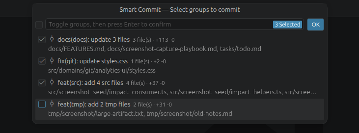
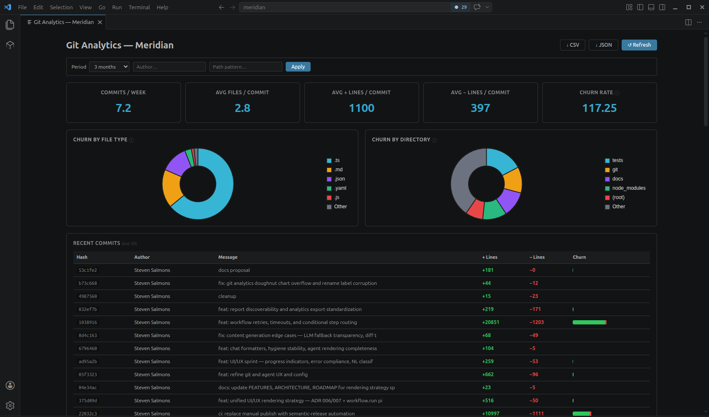
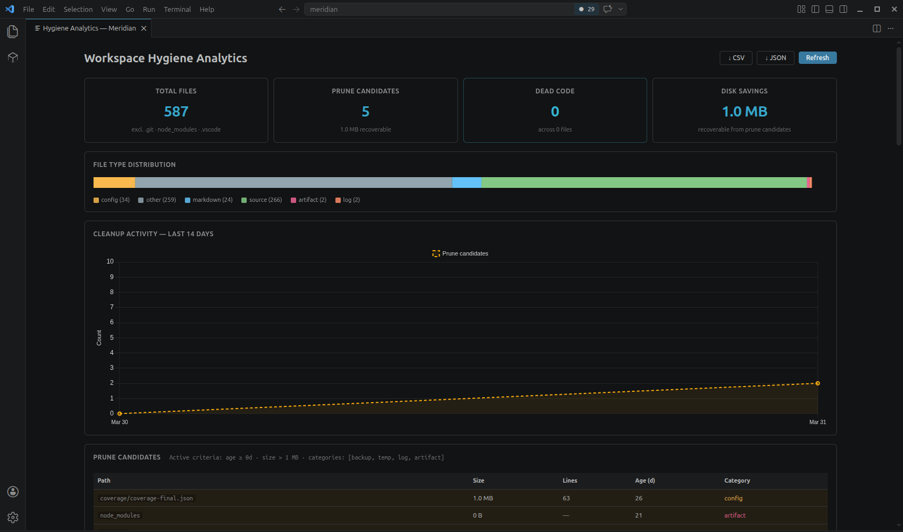

# Meridian

Meridian turns your uncommitted changes into clean, grouped commits, generates your PR docs, and surfaces the codebase context you need to ship confidently — all without leaving VS Code.

Whether you work from the command palette, the sidebar, or `@meridian` in Copilot Chat, the goal is the same: less manual overhead between local changes and review-ready output.

---

## Smart Commit

Smart Commit collects all your uncommitted changes — staged and unstaged — and clusters them into groups by structural proximity: shared directory, file type, and change type. Each group gets a deterministic commit message based on what actually changed, not an LLM guess. You pick which groups to commit, edit any message you want, and confirm. Each approved group becomes a separate commit. One command replaces the manual stage-message-commit cycle.

## Pull Requests

Meridian covers the full PR lifecycle from branch diff to final polish. Generate a description with title, summary, grouped changes, and test plan. Run AI review for a single verdict (approve, request changes, or comment) with per-file comments tagged by severity. Or generate targeted inline feedback on specific files when you need tighter review focus.

## Session Briefing & Analytics

Session Briefing gives you immediate context: branch state, recent commits, uncommitted files, and workspace flags like large change counts or detached HEAD. Start your day oriented, or get your bearings after switching branches.

Git Analytics visualizes churn, volatility, and authorship in one dashboard, with JSON and CSV export for reporting or downstream analysis.

## Code Health

Hygiene Scan surfaces dead files, large files, stale logs, markdown bloat, and dead code (unused imports, locals, parameters). Preview what would be removed with dry-run, then clean up in one pass.

Impact Analysis traces importers, call sites, and test-file coverage for a given symbol so you can estimate blast radius before touching critical code.

---

## Workflows & Agents

Define JSON workflows with retries, timeouts, and conditional step routing for repeatable multi-step automation. Agents add reusable execution profiles that can run approved commands and workflow targets. This is the power-user layer for teams that want consistent automation inside VS Code.

---

## Documentation

- [Feature Reference](docs/FEATURES.md)
- [Architecture](docs/ARCHITECTURE.md)
- [Roadmap](docs/ROADMAP.md)
- [Publishing (VS Marketplace & Open VSX / Cursor)](docs/EXTENSION_DISTRIBUTION.md)

## Requirements

- VS Code 1.91+
- Node.js 22+

## License

MIT
